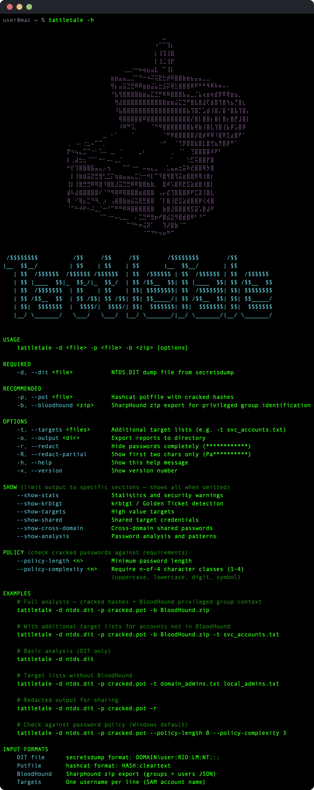
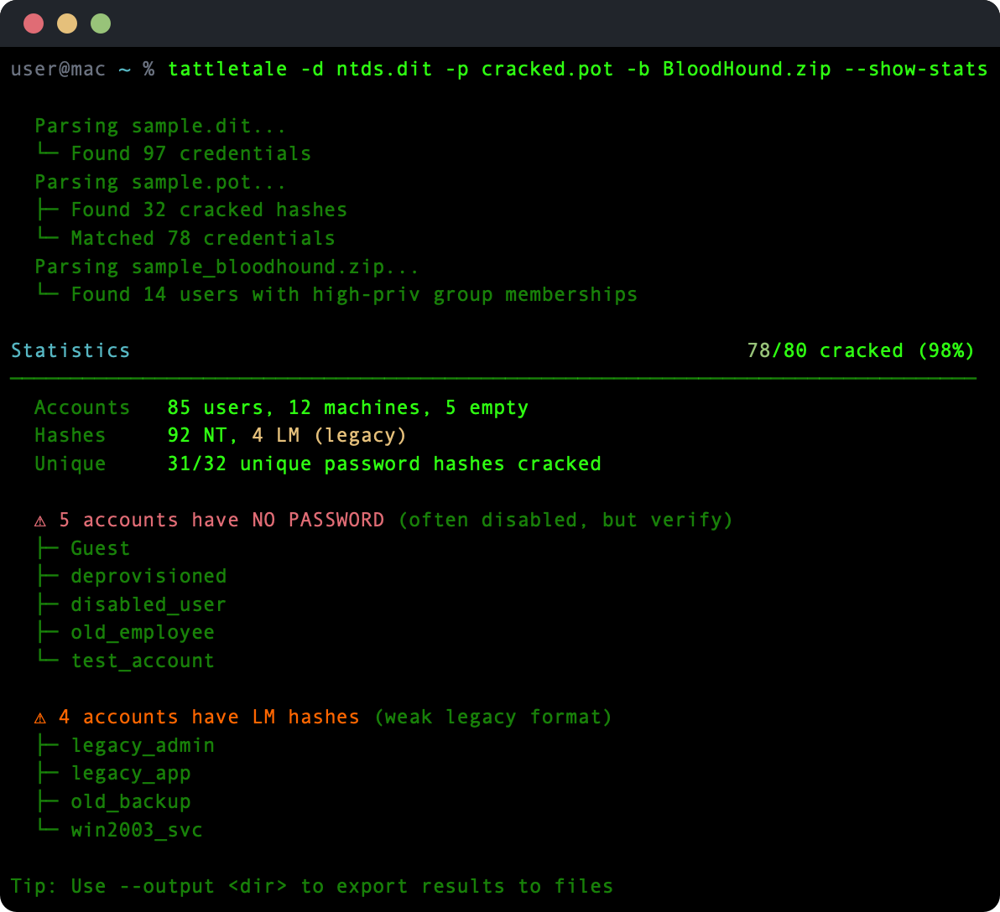
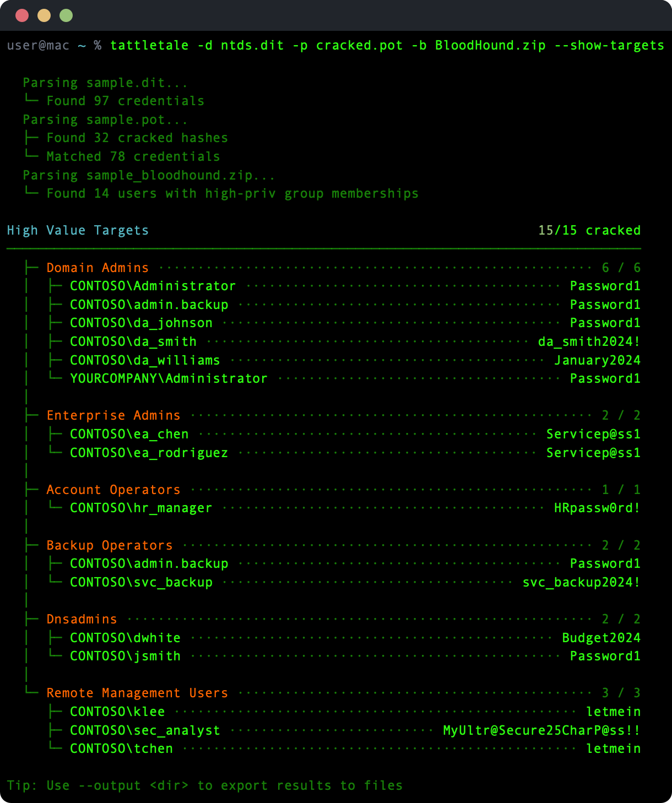
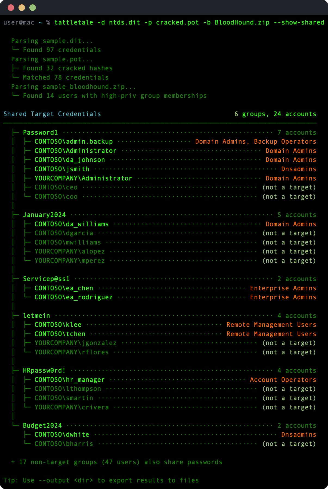

# TattleTale

[](https://pypi.org/project/tattletale/)
[](https://pypi.org/project/tattletale/)
[](https://opensource.org/licenses/MIT)
[](https://www.python.org/downloads/)



Analyze secretsdump output and hashcat potfiles to find shared passwords, weak credentials, and other issues in Active Directory. No dependencies.

Built from years of hands-on experience in enterprise penetration testing. Used in real-world assessments of Fortune 500 companies and critical infrastructure.

## Install

#### pip

```bash
pip install tattletale
```

#### Standalone

It's a single Python file with no dependencies. Grab it and go:

```bash
curl -O https://raw.githubusercontent.com/coryavra/tattletale/master/tattletale.py
```

#### Container

The included `Containerfile` works with [Apple Containers](https://github.com/apple/containerization) (macOS 26+) and Docker (OCI-compliant).

```bash
# Apple Containers (native to macOS)
container build -t tattletale .
container run --rm -v "$(pwd)/data:/mnt/shared" tattletale \
    -d /mnt/shared/ntds.dit \
    -p /mnt/shared/cracked.pot \
    -o /mnt/shared/report

# Docker works too
docker build -t tattletale .
docker run --rm -v "$(pwd)/data:/mnt/shared" tattletale \
    -d /mnt/shared/ntds.dit \
    -p /mnt/shared/cracked.pot \
    -o /mnt/shared/report
```

## Usage

```
tattletale -d <file> [-p <file>] [-t <files>] [options]

REQUIRED
    -d, --dit <file>            NTDS.DIT dump file from secretsdump

OPTIONS
    -p, --pot <file>            Hashcat potfile with cracked hashes
    -t, --targets <files>       Target lists, space-separated (e.g. -t admins.txt svc.txt)
    -o, --output <dir>          Export reports to directory
    -r, --redact                Hide passwords completely (************)
    -R, --redact-partial        Show first two chars only (Pa**********)
    -h, --help                  Show this help message
    -v, --version               Show version number

POLICY (check cracked passwords against requirements)
    --policy-length <n>         Minimum password length
    --policy-complexity <n>     Require n-of-4 character classes (1-4)
                                (uppercase, lowercase, digit, symbol)
```

## Examples

```bash
# Basic analysis - just the dump file
tattletale -d ntds.dit

# With cracked hashes from hashcat
tattletale -d ntds.dit -p hashcat.pot

# Track high-value targets (multiple lists works)
tattletale -d ntds.dit -p hashcat.pot -t domain_admins.txt svc_accounts.txt

# Redacted output for screenshotting
tattletale -d ntds.dit -p hashcat.pot -r

# Check cracked passwords against policy (8 chars, 3-of-4 complexity)
tattletale -d ntds.dit -p hashcat.pot --policy-length 8 --policy-complexity 3
```

## Output

### Statistics

Overview of the dump: total accounts, cracking progress, hash types, and security warnings like empty passwords or legacy LM hashes.



### High Value Targets

Shows the status of accounts from your target lists.



### Shared Credentials

Accounts that share the same password hash. Grouped by password with target accounts highlighted.



### Password Analysis

Pattern analysis across all cracked passwords: length distribution, character composition, common patterns (seasons, years, keyboard walks), and most common passwords.


## Input formats

| File | Format | Example |
|------|--------|---------|
| DIT dump | secretsdump output | `DOMAIN\user:1001:LM_HASH:NT_HASH:::` |
| Potfile | hashcat potfile | `NT_HASH:cleartext` |
| Targets | one username per line | `administrator` |

## See also

Standing on the shoulders of giants:

- [secretsdump.py](https://github.com/fortra/impacket) - extract hashes from NTDS.DIT
- [hashcat](https://hashcat.net/hashcat/) - crack the hashes
- [CrackMapExec](https://github.com/byt3bl33d3r/CrackMapExec) - password spraying and more

## License

MIT
